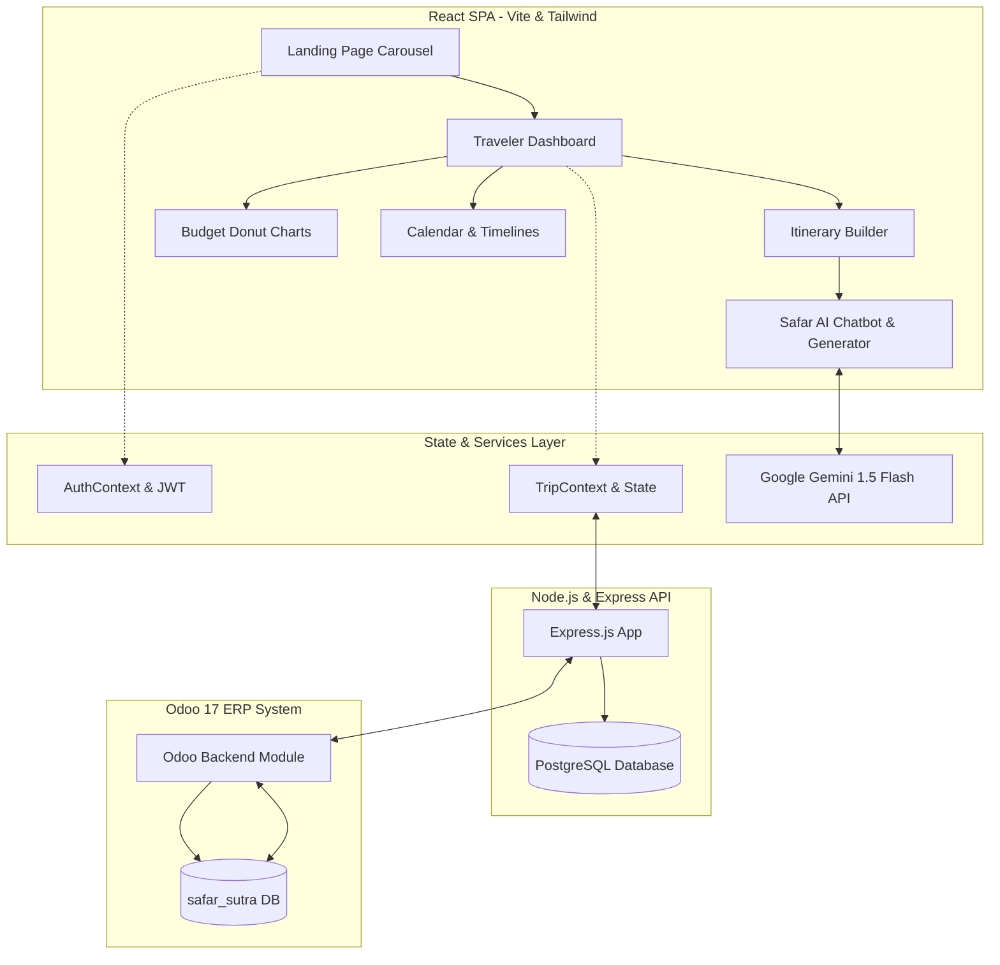

# SafarSutra  – Intelligent Sacred Yatra & Global Travel Planner

> **SafarSutra** is an AI-powered, multi-city travel planning platform tailored for spiritual yatras, heritage journeys, and global adventures. It seamlessly combines real-time generative AI intelligence (Google Gemini), interactive day-by-day itinerary builders, visual budget tracking, and community trip sharing with a premium sapphire-blue aesthetic.

---

## 🎨 Brand Identity & Logo
The application features a custom-designed, theme-integrated logo:
* **The Compass Core:** A rotating global latitude/longitude coordinate dial representing global travels, with a glowing, pulsing temple silhouette (`temple_hindu`) at its center to represent sacred pilgrimages.
* **Typography:** Stacked serif branding using Google's **Cinzel** font, styled in a metallic **Sapphire & Crystal Blue** chiseled gradient with hanging drop-cap initial **S** letters inspired by the classic Lord of the Rings aesthetic.

---

## 🗺️ System Architecture Flow



---

## 🌟 Core Features

### 1. Immersive Carousel Landing Page
* Full-screen high-definition transitions showcasing spiritual and heritage landmarks (including the floating **Jag Niwas Palace in Udaipur**).
* Staggered right-floating preview cards that scale up dynamically when active, displaying locations and star ratings above the card bounds.

### 2. Intelligent Traveler Dashboard
* Clean, widget-based dashboard styled in a premium **Sapphire Blue** (`#0288d1`) and **Ice-Blue** (`#e1f5fe`) theme.
* Centralized stats counters tracking visited countries/destinations and planned yatras.
* Real-time budget progress bar alerts and quick links to check expenses or generate trips.

### 3. "Safar AI" Travel Companion
* **Generative Trip Builder:** Craft customized day-wise itineraries with temple darshan rules, Aarti timings, Satvik dining recommendations, and transportation logistics.
* **Dual Engines:** Utilizes **Google Gemini 1.5 Flash API** for real-time generative intelligence with custom user API key configurations.

### 4. Interactive Itinerary Planner
* Build schedules day-by-day, add custom stops, allocate budget parameters, and review trip progress indicators.
* Toggle views between expandable monthly calendars and structured vertical timelines.

### 5. Smart Budget Tracking
* Visual cost breakdowns using interactive SVG Donut charts.
* Expense warnings, category-wise expenditure limits, and average daily cost updates.

---

## 🛠️ Complete Feature Matrix (13 Core Screens)

| # | Feature / Screen | Key Functionality |
|---|---|---|
| 1 | **Auth & Carousel** | Full-screen carousel with custom timing, user login, and email credentials. |
| 2 | **Dashboard Hub** | Central traveler hub with quick stats, upcoming trips, budget highlights, and AI modals. |
| 3 | **Create Trip Modal** | Date range selectors, cover photo assignments, and budget trackers. |
| 4 | **My Trips** | Filterable layouts of active, completed, upcoming, and planning itineraries. |
| 5 | **Itinerary Builder** | Dynamic stop adder, city manager, and activity scheduler with real-time costs. |
| 6 | **Itinerary View** | Structured timeline and grouped summary views with duration and expense badges. |
| 7 | **City Search** | Destination finder filtered by popularity ratings, region, and categories. |
| 8 | **Activity Search** | Curated experiences including Spiritual, Heritage, Nature, Culture, and Dining categories. |
| 9 | **Trip Budget & Cost** | SVG Donut charts, category expense tracking, daily spend averages, and overbudget alerts. |
| 10 | **Calendar & Timeline** | Interactive monthly date matrix and vertical timeline flow with day inspect panels. |
| 11 | **Public Share View** | One-click public shareable links with social sharing and a "Copy This Trip" cloning CTA. |
| 12 | **User Profile** | Personal profile updates, language preferences (Hindi, English, Sanskrit), and saved wishlists. |
| 13 | **Admin & Analytics** | Adoption dashboard showing popular destinations and traveler activity metrics. |

---

## 🚀 Getting Started

### 1. Clone & Install
```bash
# Clone the repository
git clone https://github.com/Chiragprajapat003/safar_sutra.git
cd safar_sutra

# Install Frontend dependencies
cd frontend
npm install
```

### 2. Configure Environment Variables
Create a `.env` file in the `frontend/` directory (or use `.env.example`):
```env
VITE_GEMINI_API_KEY=your_gemini_api_key_here
```

### 3. Run Development Server
```bash
npm run dev
```
Open **`http://localhost:5174`** in your browser.

---

## 🌐 Production Deployment
* **Vercel:** Configured via `vercel.json` for React Router single-page application redirection.
* **Netlify:** Configured with `frontend/public/_redirects` for client-side routing.
